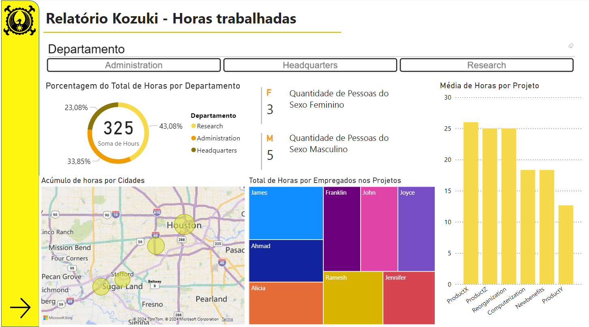
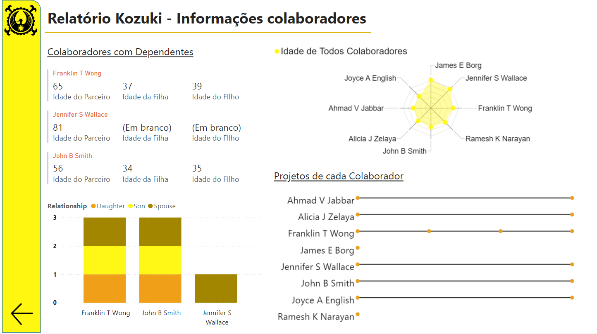

# Processamento de Dados Simplificado com Power BI

## 📊 Relatório da sociedade Kozuki

Este desafio propõe explorar os conceitos aprendidos e aplicar as etapas de coleta, obtenção e transformação de dados com Power BI e MySQL. Inicialmente foi pedido para utilizar MySQL na Azure, porém devido a problemas técnicos não pode ser realizado na Azure. Então, como solução o banco de dados foi criado no próprio MySQL Workbench.

<u><b> 
Processando e Transformando Dados com Power BI </b></u>

[ Desafio de Projeto - (Intermediário)](https://web.dio.me/lab/processando-e-transformando-dados-com-power-bi/learning/dc02898f-eee6-48b1-90b5-c0ef3f4f375a)

### 📑Objetivo principal:

 - Crie o esquema do banco de dados;
 - Extraia dados relevantes;
 - Transforme esses dados para fins analíticos;
 - Visualize os dados transformados usando PowerBI.

 ### ❗ Atenção:

- Design Estruturado: O layout é organizado sistematicamente para fácil navegação e interpretação;
- Auxílios à navegação: botões interativos são incorporados para aprimorar a navegação do usuário no painel do PowerBI;

## Mudanças realizadas
✔ Entre as Queries realizadas para criar novas tabelas com consultas, foi separado o endereço que era inicialmente completo com número, rua, cidade e estado.

✔ No Power BI foi mesclado a Cidade com o Estado para ser possível gerar uma visualização com o mapa mundi.

✔ Outra consulta gerada no MySQL foi com o valor das idades tanto dos empregados quanto dos dependentes.

✔ No Power BI foi necessário alterar a forma da tabela, então utilizou tabela dinâmica nos tipos de Relacionamentos com dependentes e as idades dos mesmos, por fim agrupando pelos empregados.

✔ O valor do salário dos empregados precisou ajeitar a formatação. Ajuste no tipo de formato das horas, pois não era a correta.

## Resultado

🧱 [Arquivo do Power BI](https://github.com/limasfernanda/Company_Kozuki_analysis/blob/main/relatorio_company.pbix)

🌀 [Arquivo do MySQL](https://github.com/limasfernanda/Company_Kozuki_analysis/blob/main/sql_company.sql)

📑 [Relatório de Análise empresa Kozuki](https://github.com/limasfernanda/Company_Kozuki_analysis/blob/main/relatorio_company.pdf)

 
O banco de dados foi criado no próprio MySQL Workbench, uma empresa fictícia. Principais objetivos: (i) criar o esquema do banco de dados, (ii) extrair dados relevantes, (iii) transformar esses dados para fins analíticos, (iv) visualize os dados transformados usando Power BI. As tabelas dos funcionários e dependentes tinham armazenadas a data de aniversário, assim foi realizada um consulta para obter as idades de acordo com o dia atual. Descobriu-se que o departamento com mais projetos e horas trabalhadas é o de Pesquisa, que o empregado com mais projetos em andamento é o terceiro mais velho, e o colaborador que tem mais horas em projetos em andamento possui idade mais avançada (+65).

 

  
 Figura 1 
    

 

 Figura 2
    

